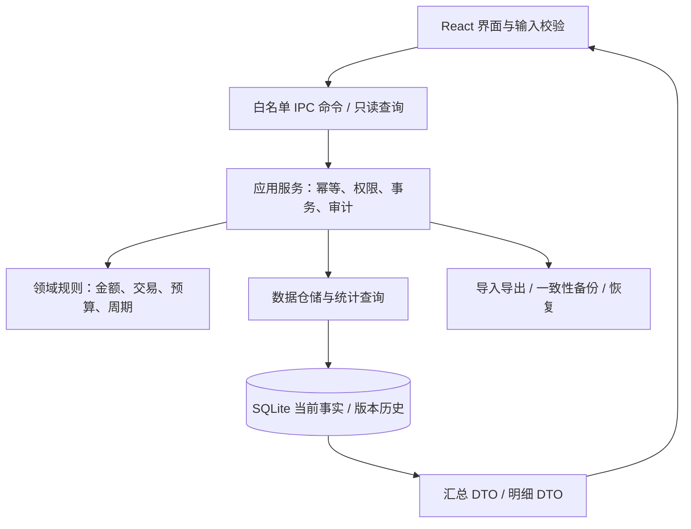
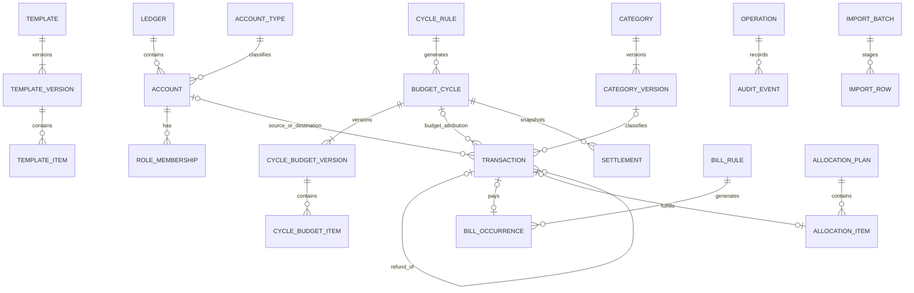

# 薪流 SalaryFlow · 技术、数据库与验证设计

## 0.9统计边界与展示状态实现补充

- `ledgerStartDate` 是快照派生字段，取未删除交易的最早 `transaction_date` 与未删除账户的最早 `start_date` 中较早者；不建立重复交易或统计周期表。
- 周期选择器在表现层按本地日历生成半开区间 `[start,end)`；自然周以周一开始并使用ISO周年，月和年按自然边界。截止日期在界面显示为 `end-1 day`。
- “安心支出”金额沿用整数分的 `max(0,min(remainingBudget,spendingBalance))`。颜色使用只读派生比例，不参与余额、预算或交易计算；缺少预算/账户和零值使用显式状态，避免除零或错误绿色。
- 本次只增加快照派生字段、界面状态和日期选择逻辑，不改变表结构，PC schema 6与移动schema 4保持不变。

## 0.8.1实现补充

数据库schema 5新增`receivables`与`receivable_repayments`。每次借出/归还与一条`ADJUSTMENT`资金记录一一关联，在同一SQLite事务内写入；schema 6为待收款增加软删除标记，撤销时原子软删除全部关联资金记录并保留审计；报表只聚合INCOME/EXPENSE/REFUND，因此不会污染收支。金额仍为整数分，余额不足、超额归还、日期和revision均在提交前校验。

移动schema 3采用相同两表、资金口径与待收款软删除机制。Android/iOS共用Expo SDK 57工程、SQLite仓储和页面代码；iOS使用固定Bundle ID `com.xrosen26.salaryflow`，当前Windows环境完成bundle导出，原生签名留给macOS/Xcode。

0.5增量：settings JSON增加amount_visibility，包含master、overview三卡和动态account id映射，兼容旧hide_amounts；显示判定不参与金额计算。setPayday以IMMEDIATE/NEXT_WEEK显式模式更新开放周期和cycle_rules，事务内验证交易范围及结算快照。resetLedger在主进程原生二次确认后关闭SQLite，限定路径删除主库/WAL/SHM和可选的SalaryFlow命名备份，再创建空账本并重载；schema保持3。

0.4增量：core/charts.mjs用BigInt完成日期分组与饼图合计，src/Charts.tsx负责本地SVG图表及交互；仅坐标/比例映射使用Number，财务金额标签由整数分字符串格式化。settings JSON增加palette（六值白名单），不更改schema或既有迁移。视图配色不参与财务计算。

## 0.3实现增量（2026-09-07）

schema仍为3，不改已发布SQL。余额保护和自定义分类创建在主进程数据库事务中执行；允许负余额是settings JSON中的显式偏好。待办历史使用现有bill_occurrences状态，不另建交易副本。分析增加前一等长区间与收入分类聚合。

core/storage.mjs负责位置配置与迁移：父目录下创建SalaryFlow-data，Online Backup生成快照、验证后以排他创建方式复制ledger.sqlite，保留备份，再原子提交默认用户目录的location.json。重启后切换userData；原账本保留，不覆盖已有目标库。自选磁盘不可用时停止启动，不自动新建空账本。默认用户目录保留小型路径配置文件，应用缓存位于当前userData。清理缓存调用Electron session.clearCache，不删除账本或审计。

版本：V1 已确认架构基线｜2026-09-06｜Windows应用0.7.0、Android应用0.2.0已实现。实际采用Electron备选、Node SQLite、数据库schema 4；真实DDL与设计差异见 [IMPLEMENTATION.md](./IMPLEMENTATION.md)。下文候选模型保留用于设计追溯，不代表所有P1/P2表已实现。

业务定义以 [PRD.md](./PRD.md) BR01—BR13 为准；页面见 [PRODUCT_DESIGN.md](./PRODUCT_DESIGN.md)。D20 技术选型、D02 范围及其他业务决策确认后才能冻结本模型。下文是可评审的数据字典与约束设计，不是已执行的 migration。

## 1. 技术路线与取舍

| 路线                              | 优点（架构判断）                                               | 代价                                                     | 建议                                       |
| --------------------------------- | -------------------------------------------------------------- | -------------------------------------------------------- | ------------------------------------------ |
| Tauri 2 + React/TypeScript + Rust | 适合本地应用，将账务与文件权限集中在Rust端，Web UI可做清晰表格 | TS/Rust两套工程；Windows依赖WebView2，桌面测试需专门链路 | 候选首选，先验证最小打包/数据库/恢复纵切片 |
| Electron + React/TypeScript       | 若维护者只熟悉TS，可减少语言切换                               | 自带运行时，需管理进程隔离、IPC与原生SQLite模块打包      | 明确的备选，不在确认前同时搭两套正式工程   |
| .NET/WPF + Microsoft.Data.Sqlite  | 适合Windows专用和C#维护者，原生桌面集成直接                    | UI与前述Web方案不共享，设计实现路径不同                  | 若用户已有C#经验可改选，开发前确认         |

推荐是对本项目的工程判断，不是官方性能排名；尚未测量包体、内存或启动速度。Tauri官方说明Windows安装器可选NSIS的exe或WiX的msi，WebView2有下载及离线部署方式；因此“应用离线使用”与“首次完全离线安装”需分别确认。[Tauri Windows安装说明](https://v2.tauri.app/distribute/windows-installer/)

Electron备选必须关闭渲染层Node集成、启用上下文隔离并校验IPC调用来源，避免把数据库与文件写权限直接交给页面。[Electron安全指南](https://www.electronjs.org/docs/latest/tutorial/security)

### 候选组件

| 领域           | 方案与边界                                                                                                 |
| -------------- | ---------------------------------------------------------------------------------------------------------- |
| UI             | React + TypeScript + Vite；本地打包静态资源；CSS变量主题和可访问基础控件；无远程CDN依赖                    |
| 核心账务       | Rust领域服务，Money/LocalDate/DateRange/TransactionKind类型；前端不能自行推导最终余额                      |
| SQLite         | rusqlite，固定构建中的SQLite版本；bundled及backup能力在纵切片验证；参数化SQL，手写版本化migration          |
| 状态           | TanStack Query管理通过IPC读取的数据缓存；React局部状态管理表单/导航/主题；P0不再引入第二个全局业务状态库   |
| 图表           | Apache ECharts，按需图形；精确金额来自同一查询结果；图表浮点坐标仅用于绘图，不回写账务                     |
| 导入           | Rust CSV解析和显式字段映射；统一规范化与预检；平台账单适配器P1                                             |
| CSV/JSON       | Rust csv与serde_json候选；金额输出规则独立于库，JSON分单位字符串；开发时锁定版本                           |
| XLSX（P1）     | rust_xlsxwriter，金额/文本明确写类型，工作表来自统一报表DTO                                                |
| Markdown（P1） | 本地模板生成周期复盘，转义表格分隔符与用户文本；不依赖大模型                                               |
| 自动备份       | Rust后台任务调用SQLite在线备份，应用启动/日间变更/危险操作前触发；非Windows常驻服务                        |
| 打包           | Windows x64 NSIS候选；数据目录独立；Win11验收，其他版本与架构按D20确定                                     |
| 测试           | Rust单元/属性/真实SQLite集成；Vitest + Testing Library候选；Windows桌面E2E用tauri-driver + WebdriverIO候选 |

rusqlite提供Rust SQLite接口与可选备份模块。[rusqlite官方API](https://docs.rs/rusqlite/latest/rusqlite/) TanStack Query用于缓存、失效与异步数据生命周期，本项目将IPC视作数据访问函数，而不是引入网络服务器。[TanStack Query概览](https://tanstack.com/query/latest/docs/framework/react/overview) ECharts提供图表构建能力。[ECharts官方入门](https://echarts.apache.org/handbook/en/get-started/) XLSX候选库的写入能力以其官方API为准。[rust_xlsxwriter文档](https://docs.rs/rust_xlsxwriter/latest/rust_xlsxwriter/)

不把网页端模拟测试当作桌面端验证。Tauri官方提供WebDriver路径，Windows相关驱动与WebView2版本匹配需在M1实机验证。[Tauri WebDriver说明](https://v2.tauri.app/develop/tests/webdriver/)

依赖精确版本在M1验证后写入Cargo.lock与前端锁文件；本稿不把网页上“latest”版本当成长期可复现构建承诺。

## 2. 分层与命令边界

前端输入预校验只改善体验，Rust必须重新校验所有约束。数据库只由单一后台写队列修改；只读查询可以独立连接但全部启用外键。应用单实例锁避免两个进程误操作同一账本。渲染层不暴露任意SQL、任意路径写或shell命令，只暴露业务命令和用户选择文件的有限权限。

候选命令：create_account、set_default_role、record_transaction、edit_transaction、delete_transaction、restore_transaction、record_refund、save_cycle_budget、open_cycle、settle_cycle、reopen_cycle、confirm_bill、confirm_allocation_item、commit_import、create_backup、restore_backup。各变更携带operation_id、expected_revision和必要原因；删除、导入、恢复有单独影响预览。

保存流程：BEGIN IMMEDIATE → 检查operation_id重放和实体版本 → 校验关联数据与周期 → 插入本次operation_batches行 → 写当前事实 → 追加不可变审计快照 → 完成操作结果、账本data_revision加一 → COMMIT → 发布数据变更事件。operation_batches在提交前可补齐result，提交后不可变，避免事实行FK指向尚不存在的操作行。只有成功提交才向UI返回成功。报错回滚所有业务行和历史行。文件系统操作采用独立阶段协议，不能声称跨SQLite和文件系统有一个天然原子事务。

缓存键包含账本ID/修订号/筛选条件。所有财务变更先整体失效财务查询缓存，P0接受保守刷新；数据多后再按账户/日期优化。审计表不参与当前余额SUM，不从历史快照再生成一份可统计交易。

## 3. 金额、日期与类型规范

SQLite INTEGER可存有符号64位整数；SQLite默认类型亲和性不等于强类型保证。本项目财务表建议STRICT，并对整数、枚举、日期和关联类型增加约束。[SQLite数据类型](https://www.sqlite.org/datatype3.html)

| 记号  | 存储定义                                                                           |
| ----- | ---------------------------------------------------------------------------------- |
| ID    | TEXT，不可变UUID，由应用生成；PK均NOT NULL；不能用名称作为主键                     |
| MONEY | INTEGER，单位分；普通正金额、预算非负、期初/校准允许有符号；不使用REAL/浮点DECIMAL |
| DATE  | TEXT，严格YYYY-MM-DD本地日历日，应用校验实际有效日期和固定宽度，支持字典序索引     |
| TS    | TEXT，固定格式UTC时间戳；只作审计与操作顺序，不替代DATE做周期归属                  |
| BOOL  | INTEGER，CHECK IN(0,1)                                                             |
| JSON  | TEXT，CHECK json_valid；跨语言金额值以十进制分字符串表达                           |
| REV   | INTEGER正数，乐观锁版本；不是schema_version                                        |

业务金额用i64存储、i128进行中间累加和比例乘法，所有输入/输出做边界检查。IPC的金额使用十进制分字符串，前端显示与编辑采用字符串转换/BigInt，不能先用parseFloat乘100。用于图表的近似Number不允许参与汇总或导出。

单笔与账户余额上限采用BR01建议值；全账本累计也要显式检查，不假设账户数有限。SQLite整数SUM溢出必须报错，不能降为REAL继续算。若范围累计可能超i64，改为流式读取分组数据在Rust i128累加，最后检查响应允许范围。利率/比例未来以整数分数或基点保存；P0百分比显示四舍五入一次，不逐笔舍入再加。

日期范围统一[start,end_exclusive)，在UI边界把包含截止日转换成次日。任何涉及今天的查询由账本时区确定同一个today参数，不能前后端分别取时间导致跨午夜不一致。自然月算法与固定天数算法分开测试。

## 4. SQLite数据字典

### 4.1 通用约定与边界

下表未标“?”的字段为NOT NULL，?表示可空。枚举为TEXT+CHECK。标注S的实体附带created_at TS、updated_at TS、deleted_at TS?、revision REV；软删除不等于归档，archived_at另列。标注I的记录为追加式不可变，仅有created_at TS（若表已有applied_at/committed_at等则不重复）。普通外键均ON DELETE RESTRICT、ON UPDATE RESTRICT，除4.7明确豁免的技术暂存数据。

P0一个SQLite库只有一个ledger，CHECK固定singleton=1并UNIQUE，其他实体仍带ledger_id→ledgers.id方便归属校验；同库不实现多账本。所有命令验证关联实体属于此ledger；SQL复合唯一键可在扩多账本时加强，但不能仅添加ledger_id就声称支持多账本。

下面列出的表构成推荐P0完整模型；P1/P2表明确另列，不预建空功能。

### 4.2 账本、账户、分类

| 表/阶段                         | 字段（含PK/FK）                                                                                                                                                                                         | 约束/用途                                                                                                                        |
| ------------------------------- | ------------------------------------------------------------------------------------------------------------------------------------------------------------------------------------------------------- | -------------------------------------------------------------------------------------------------------------------------------- |
| ledgers / P0 S                  | id ID PK；singleton INTEGER UNIQUE CHECK=1；name TEXT；currency TEXT CHECK='CNY'；timezone TEXT；data_revision INTEGER≥0；settings JSON；default_template_version_id ID? FK→budget_template_versions.id | settings含主题、初始化完成标记、记账起点、备份偏好；业务工资周期用独立表；首次创建默认版本后再设置指针                           |
| account_types / P0 S            | id ID PK；ledger_id FK；name TEXT；kind TEXT CHECK='ASSET'；sort_order INTEGER                                                                                                                          | P0只允许资产性质；用户自定义载体名称不能解锁信用卡/投资能力；类型归档用deleted_at，不影响已有账户                                |
| accounts / P0 S                 | id ID PK；ledger_id FK；type_id FK→account_types；name TEXT；currency TEXT CHECK='CNY'；balance_start_date DATE；is_hidden BOOL；sort_order INTEGER；note TEXT；archived_at TS?                         | 不存current_balance或可改opening_balance字段；一次有效OPENING交易，账户基准日一致；资产性质不能由改显示类型改变                  |
| account_role_memberships / P0 S | id ID PK；ledger_id FK；account_id FK→accounts；role TEXT CHECK IN('SALARY','SPENDING','SAVINGS')；effective_from DATE；effective_to DATE?                                                              | 同账户可有多角色；同角色同账户有效区间不重叠；日期精度按日，范围半开；新增/变更不重写旧区间                                      |
| account_role_defaults / P0 S    | id ID PK；ledger_id FK；role TEXT；account_id FK→accounts                                                                                                                                               | 一个角色最多一个当前默认；必须有当前有效membership，且账户可用；删除membership前需处理默认引用                                   |
| categories / P0 S               | id ID PK；ledger_id FK；kind TEXT CHECK IN('INCOME','EXPENSE')；sort_order INTEGER；archived_at TS?                                                                                                     | 稳定身份，与名称/层级版本分开；有引用不能改kind                                                                                  |
| category_versions / P0 I        | id ID PK；category_id FK→categories；version_no INTEGER>0；name TEXT；parent_version_id ID? FK→category_versions；path_label TEXT                                                                       | UNIQUE(category_id,version_no)；新版本发布后不可改；路径是当时标签快照；父级同ledger同kind，无环；首版最多两级，父节点不直接记账 |

显示当前分类取该ID最新版本，历史交易/预算指向确切版本。父类改名只影响之后创建的子类版本；服务在同一操作中发布受影响子类的新版本，历史引用保持不动。UI当前分组与历史分组因此都有确定路径。账户改名在当前列表统一使用新名，旧名从audit_events还原；账户ID保持不变，不改历史金额。

角色的effective_from/to描述用途在日历上的有效区间，P0只允许从今天起变更；同日重复更改作为该日配置修订记入审计，日级历史取最终值。P1储蓄流向按交易日角色区间统计，若要时分秒级角色归属需要额外模型，不在P0隐式支持。

### 4.3 模板、工资规则与预算周期

| 表/阶段                         | 字段（含PK/FK）                                                                                                                                                                                                                                                                | 约束/用途                                                                                               |
| ------------------------------- | ------------------------------------------------------------------------------------------------------------------------------------------------------------------------------------------------------------------------------------------------------------------------------ | ------------------------------------------------------------------------------------------------------- |
| budget_templates / P0 S         | id ID PK；ledger_id FK；name TEXT；origin TEXT CHECK IN('SYSTEM','PERSONAL')；seed_key TEXT?；seed_version TEXT?；archived_at TS?                                                                                                                                              | SYSTEM应用只读；来自可版本化配置资源；PERSONAL可迭代，P0只暴露一个个人默认，P1开放多模板                |
| budget_template_versions / P0 I | id ID PK；template_id FK→budget_templates；version_no INTEGER>0；reason TEXT                                                                                                                                                                                                   | UNIQUE(template_id,version_no)；完整快照头；空白模板也有版本                                            |
| budget_template_items / P0 I    | id ID PK；template_version_id FK→budget_template_versions；category_id FK→categories；category_version_id FK→category_versions；amount_minor MONEY≥0；is_enabled BOOL；note TEXT；sort_order INTEGER                                                                           | UNIQUE(template_version_id,category_id)；版本ID必须属于同一category；只有支出叶子分类；停用额度不计总额 |
| cycle_rules / P0 I              | id ID PK；ledger_id FK；effective_from DATE；payday INTEGER CHECK BETWEEN 1 AND 31；short_month_policy TEXT CHECK='LAST_DAY'；reason TEXT                                                                                                                                      | UNIQUE(ledger_id,effective_from)；规则按时间追加；历史引用不改；不支持多组重叠周期                      |
| budget_cycles / P0 S            | id ID PK；ledger_id FK；rule_id FK→cycle_rules；start_date DATE；end_date_exclusive DATE；status TEXT CHECK IN('DRAFT','OPEN','CLOSED')；data_completeness TEXT CHECK IN('COMPLETE','PARTIAL','UNKNOWN')；recorded_from DATE?；expected_income_minor MONEY? CHECK≥0；note TEXT | start<end；UNIQUE(ledger_id,start_date)；触发器防重叠，服务保证已覆盖区间连续；有引用不删除             |
| cycle_budget_versions / P0 I    | id ID PK；cycle_id FK→budget_cycles；version_no INTEGER>0；source_kind TEXT CHECK IN('DEFAULT','PREVIOUS','BLANK','EDIT','TEMPLATE')；source_template_version_id ID? FK→budget_template_versions；source_cycle_budget_version_id ID? FK→cycle_budget_versions；reason TEXT     | UNIQUE(cycle_id,version_no)；第1版为最初预算；最新版本为当前；来源字段按kind校验；完整快照              |
| cycle_budget_items / P0 I       | id ID PK；budget_version_id FK→cycle_budget_versions；category_id FK→categories；category_version_id FK→category_versions；amount_minor MONEY≥0；is_enabled BOOL；note TEXT；sort_order INTEGER                                                                                | UNIQUE(budget_version_id,category_id)；停用/删除行保留0有效额度；实际从交易算，不存在actual字段         |
| cycle_settlements / P0 I        | id ID PK；cycle_id FK→budget_cycles；settlement_no INTEGER>0；budget_version_id FK→cycle_budget_versions；data_revision INTEGER；rule_version TEXT；metrics JSON；note TEXT；settled_at TS                                                                                     | UNIQUE(cycle_id,settlement_no)；metrics存当时I/E/B/S/调整及期末账户余额字符串；旧快照不更新             |

周期状态变更写audit_events。结算的预算版本必须属于同周期；打开后再关闭生成新快照，不覆写settlement_no。当前是否已被修订由周期状态、最新结算和该周期受影响审计事件判断；全账本data_revision不同本身不代表此周期过期，UI不能因修改无关月份就把全部历史结算标脏。

affected_scope必须记录旧/新日期、旧/新账户、直接影响周期以及账户余额传播起点。若修改较早交易改变后续结算所含账户的期末余额，相关快照加“上游修订影响”标签并展示重算对比；仅改备注或修改晚于快照截止日的交易不影响其金额。对TRANSFER/OPENING/ADJUSTMENT用日期定位直接结算影响，不能因为budget_cycle_id为NULL而跳过锁定与传播规则。是否强制重开遵循PRD BR10。

### 4.4 交易事实、操作与审计

| 表/阶段                  | 字段（含PK/FK）                                                                                                                                                                                                                                                                                                                                                                                                                                                                                        | 约束/用途                                                                                                                                                                                |
| ------------------------ | ------------------------------------------------------------------------------------------------------------------------------------------------------------------------------------------------------------------------------------------------------------------------------------------------------------------------------------------------------------------------------------------------------------------------------------------------------------------------------------------------------ | ---------------------------------------------------------------------------------------------------------------------------------------------------------------------------------------- |
| operation_batches / P0 I | id ID PK（即operation_id）；ledger_id FK；operation_kind TEXT；request_hash TEXT；result JSON；committed_at TS                                                                                                                                                                                                                                                                                                                                                                                         | 幂等提交结果；同ID同请求返回原结果，同ID不同请求拒绝；只保存成功提交，失败整批回滚                                                                                                       |
| transactions / P0 S      | id ID PK；ledger_id FK；kind TEXT CHECK IN('INCOME','EXPENSE','TRANSFER','REFUND','OPENING','ADJUSTMENT')；income_subtype TEXT? CHECK IN('SALARY','OTHER')；amount_minor MONEY；transaction_date DATE；source_account_id ID? FK→accounts；destination_account_id ID? FK→accounts；category_version_id ID? FK→category_versions；budget_cycle_id ID? FK→budget_cycles；original_transaction_id ID? FK→transactions；note TEXT；operation_id ID FK→operation_batches；reconciliation_target_minor MONEY? | 金额/端点按下表检查；operation_id表示创建操作，后续修改批次在audit记录；target仅校准使用，作为当时输入证据                                                                               |
| audit_events / P0 I      | id ID PK；ledger_id FK；operation_id FK→operation_batches；entity_type TEXT；entity_id ID；entity_revision INTEGER；action TEXT；before_data JSON?；after_data JSON?；reason TEXT；affected_scope JSON；recorded_at TS                                                                                                                                                                                                                                                                                 | UNIQUE(entity_type,entity_id,entity_revision)；通用实体引用无法用单个FK表达，服务校验，禁止用户写入；全快照包含关联ID、金额字符串、schema/规则版本；affected_scope列出影响账户/周期/日期 |

审计是可追溯历史，不是防篡改认证：拥有本机文件写权限的人仍可修改数据库，P0不声称具备不可抵赖性。数据库写入权限集中在服务；审计不可通过产品界面修改/删除。

#### 交易行形状约束

| kind       |  amount_minor | source | destination | category       | budget_cycle | original    |
| ---------- | ------------: | ------ | ----------- | -------------- | ------------ | ----------- |
| INCOME     |            >0 | NULL   | 必填        | 收入叶子版本   | 必填         | NULL        |
| EXPENSE    |            >0 | 必填   | NULL        | 支出叶子版本   | 必填         | NULL        |
| TRANSFER   |            >0 | 必填   | 必填且不同  | NULL           | NULL         | NULL        |
| REFUND     |            >0 | NULL   | 必填        | 与原支出同版本 | 必填         | 有效EXPENSE |
| OPENING    | 可为0或有符号 | NULL   | 必填        | NULL           | NULL         | NULL        |
| ADJUSTMENT |     非0有符号 | NULL   | 必填        | NULL           | NULL         | NULL        |

INCOME才允许income_subtype且必须非空；其他类型为NULL。期初/校准的amount直接作为signed_delta，普通交易方向由kind决定。所有端点币种一致。transaction_date不早于端点基准日；OPENING必须等于destination.balance_start_date。有效账户必须恰有一个有效期初，禁止单独删除；零期初可随未使用账户一并软删除。P0不支持直接编辑交易kind，错选类型需通过撤销原交易并新建正确交易的显式操作，统一验证依赖。

跨行规则由Rust服务与SQL触发器/发布前校验共同实现：退款引用同账本未删除支出、日期不早于原交易、总退款不超过原额；分类版本与原交易一致；周期日期包含该交易；周期不可已结算；同账户最多一条有效OPENING。减少原支出额、改分类、软删除及恢复都要验证这些规则，不能只在新增退款时检查。

原支出分类和关联退款联动修改时，SQLite逐行触发器不能错误拦截合法中间态：推荐在同一个写事务中先使依赖退款进入待重写的非有效状态、更新原支出、重写并恢复依赖，再做最终全组不变量校验，审计只记录用户可见的变更前后；任何异常回滚。更简单的实现可将相关跨行校验全部放统一命令服务，但必须在集成测试中证明所有写入口共享该服务，不声称一个普通CHECK就能完成跨表总额约束。最终实现方案在M1纵切片确认。

#### 余额与统计投影

不持久化第二套转账明细。逻辑视图 account_movements 从transactions UNION ALL推导：收入/退款/期初/校准向destination产生+amount；支出向source产生−amount；转账分别向source产生−amount、向destination产生+amount。全体仅取deleted_at IS NULL。这个视图是查询投影，不是复制经济事项。

账户余额按account_movements汇总；全账本收支/交易数量按transactions汇总，不能先JOIN移动视图再SUM交易金额（那会双计转账或重复行）。统计按kind明确分支，不能把所有正delta当收入。

分类预算实际按交易.category_version→categories.id汇总，与当前预算category_id对应；历史分析的展示分组使用交易引用的版本路径。一对多关联如退款、账单、审计必须先聚合再JOIN，防止原支出在多次退款JOIN后被放大。

### 4.5 账单、分配、导入与备份

| 表/阶段                          | 字段（含PK/FK）                                                                                                                                                                                                                                                                                                                       | 约束/用途                                                                                                                                      |
| -------------------------------- | ------------------------------------------------------------------------------------------------------------------------------------------------------------------------------------------------------------------------------------------------------------------------------------------------------------------------------------- | ---------------------------------------------------------------------------------------------------------------------------------------------- |
| bill_rules / P0 S                | id ID PK；ledger_id FK；name TEXT；amount_minor MONEY>0；account_id FK→accounts；category_version_id FK→category_versions；frequency TEXT CHECK IN('WEEKLY','MONTHLY')；interval_count INTEGER CHECK=1；day_of_month INTEGER?；weekday INTEGER?；start_date DATE；end_date DATE?；short_month_policy TEXT；is_enabled BOOL；note TEXT | 月规则仅day_of_month 1—31，周规则仅weekday 1—7；账户/分类为可用资产/支出叶子；停用不删历史                                                     |
| bill_occurrences / P0 S          | id ID PK；rule_id FK→bill_rules；due_date DATE；snoozed_to DATE?；rule_revision INTEGER；expected_amount_minor MONEY>0；account_id FK→accounts；category_version_id FK→category_versions；status TEXT CHECK IN('PENDING','PAID','SKIPPED')；transaction_id ID? FK→transactions；note TEXT                                             | UNIQUE(rule_id,due_date)；生成时复制规则，PAID必须有有效匹配支出；同支出最多关联一个账单；规则变更不自动改已支付实例                           |
| allocation_plans / P0 S          | id ID PK；ledger_id FK；salary_transaction_id FK→transactions；cycle_id FK→budget_cycles；input_snapshot JSON；based_on_data_revision INTEGER；status TEXT CHECK IN('DRAFT','PARTIAL','COMPLETED','CANCELLED')                                                                                                                        | 工资必须INCOME/SALARY；snapshot含B/E/余额/保留额/选择上限及算法版本；计划金额不参与任何账务统计                                                |
| allocation_items / P0 S          | id ID PK；plan_id FK→allocation_plans；source_account_id FK→accounts；destination_account_id FK→accounts；amount_minor MONEY>0；status TEXT CHECK IN('PENDING','RECORDED','CANCELLED')；transaction_id ID? FK→transactions                                                                                                            | 端点不同；RECORDED必须匹配有效TRANSFER；UNIQUE(transaction_id)防多项重复关联；同plan可有多个计划版本，通过新建计划替换未完成项，已完成关联保留 |
| import_batches / P0 S            | id ID PK；ledger_id FK；source TEXT；file_hash TEXT；original_filename TEXT；mapping JSON；status TEXT CHECK IN('STAGED','COMMITTED','REVERTED','FAILED')；summary JSON；operation_id ID? FK→operation_batches                                                                                                                        | 文件哈希用于提示不直接拒绝相同文件不同映射；导入摘要保留数量与错误行                                                                           |
| import_rows / P0 S               | id ID PK；batch_id FK→import_batches；row_number INTEGER>0；raw_data JSON；normalized_data JSON?；fingerprint TEXT?；decision TEXT CHECK IN('PENDING','ACCEPT','SKIP','ERROR')；reason TEXT；transaction_id ID? FK→transactions                                                                                                       | UNIQUE(batch_id,row_number)；暂存不计财务统计；已提交映射可审计；可按保留策略清理原始内容，保留行号/决策/映射                                  |
| external_transaction_keys / P0 I | id ID PK；ledger_id FK；source TEXT；source_account_key TEXT；external_id TEXT；transaction_id FK→transactions；import_batch_id FK→import_batches                                                                                                                                                                                     | UNIQUE(ledger_id,source,source_account_key,external_id)，包含软删除交易；external_id不能为空串；无强键不创建此行                               |
| backup_runs / P0 S               | id ID PK；ledger_id FK；destination_path TEXT；backup_kind TEXT CHECK IN('DAILY','MONTHLY','MANUAL','PRE_MIGRATION','PRE_RESTORE','PRE_IMPORT')；status TEXT CHECK IN('RUNNING','SUCCESS','FAILED','PRUNED')；checksum TEXT?；schema_version INTEGER?；data_revision INTEGER?；finished_at TS?；error_code TEXT?                      | 运行记录不是备份有效性的唯一证据；恢复后依据备份目录manifest重新扫描                                                                           |
| schema_migrations / P0 I         | version INTEGER PK；name TEXT；checksum TEXT；app_version TEXT；applied_at TS；duration_ms INTEGER≥0                                                                                                                                                                                                                                  | 不带ledger FK；数据库级migration账本，应用版本与数据库版本分开                                                                                 |

分配后删除或修改真实转账，必须更新分配项状态/关联并重算计划；账单修改/删除同理。导入transaction_id关联可指向已存在交易（跳过/关联），批次撤销只作用于本批新建且无后续依赖的事实，不能删除用户原有交易。

### 4.6 P1扩展模型（未纳入P0建表）

| 表                        | 预期字段与规则                                                                                                                                                                                    |
| ------------------------- | ------------------------------------------------------------------------------------------------------------------------------------------------------------------------------------------------- |
| financial_goals S         | id PK；ledger_id FK；name TEXT；target_minor MONEY>0；deadline DATE?；status ACTIVE/COMPLETED/CANCELLED；priority INTEGER；note TEXT                                                              |
| goal_reservation_events I | id PK；goal_id FK；account_id FK；delta_minor MONEY非0；event_date DATE；reason TEXT；transaction_id? FK；operation_id FK；可预留校验在账户总预留维度进行；释放为负；真实交易与预留事件同一批提交 |

目标当前预留由事件求和，账户当前预留是所有活动目标合计；目标付款释放与支出不能计两次花费。未来信用卡会扩展账户的会计性质和净资产视图，投资再增加估值记录，不能仅换account_types.name获得支持。拆分交易时扩transactions为头/明细模式，并迁移旧单分类记录；多币种需要原币种金额、汇率来源与本位币舍入规则，另立ADR。

### 4.7 关键索引、外键与删除策略

| 索引/约束                                         | 列或谓词                                                                                                                                | 作用                                                           |
| ------------------------------------------------- | --------------------------------------------------------------------------------------------------------------------------------------- | -------------------------------------------------------------- |
| idx_tx_date_active                                | transactions(ledger_id,transaction_date,id) WHERE deleted_at IS NULL                                                                    | 所有自然时间范围与稳定分页                                     |
| idx_tx_source_date / destination_date             | transactions(source_account_id,transaction_date,id)、(destination_account_id,transaction_date,id)，均active                             | 账户余额与资金明细                                             |
| idx_tx_cycle_category                             | transactions(budget_cycle_id,category_version_id,kind) WHERE deleted_at IS NULL                                                         | 周期预算实际                                                   |
| idx_tx_original                                   | transactions(original_transaction_id,deleted_at)                                                                                        | 退款合计/依赖检查                                              |
| uq_active_opening                                 | UNIQUE transactions(destination_account_id) WHERE kind='OPENING' AND deleted_at IS NULL                                                 | 一个账户一个有效期初                                           |
| uq_default_role                                   | UNIQUE account_role_defaults(ledger_id,role) WHERE deleted_at IS NULL                                                                   | 一个角色最多一个默认                                           |
| idx_role_period                                   | account_role_memberships(account_id,role,effective_from,effective_to)                                                                   | 校验区间重叠、当前用途                                         |
| uq_cycle_start / idx_cycle_end                    | UNIQUE budget_cycles(ledger_id,start_date)；(ledger_id,end_date_exclusive)                                                              | 查周期，另用触发器检查范围不重叠                               |
| uq_category_ver / uq_template_ver / uq_budget_ver | category_versions(category_id,version_no)；budget_template_versions(template_id,version_no)；cycle_budget_versions(cycle_id,version_no) | 确定最新/初始版本                                              |
| uq_template_item / uq_cycle_item                  | 对应版本ID+category_id                                                                                                                  | 防同分类重复预算                                               |
| idx_audit_entity / idx_audit_operation            | audit_events(entity_type,entity_id,entity_revision)；(operation_id)                                                                     | 修改历史与整组操作恢复                                         |
| uq_bill_due / idx_bill_pending                    | UNIQUE bill_occurrences(rule_id,due_date)；(status,due_date)                                                                            | 防重复实例和到期待办                                           |
| uq_bill_transaction                               | UNIQUE bill_occurrences(transaction_id) WHERE transaction_id IS NOT NULL AND deleted_at IS NULL                                         | 一个支出不重复满足两账单                                       |
| uq_allocation_transaction                         | UNIQUE allocation_items(transaction_id) WHERE transaction_id IS NOT NULL AND deleted_at IS NULL                                         | 同转账不重复分配                                               |
| uq_active_salary_plan                             | UNIQUE allocation_plans(salary_transaction_id) WHERE deleted_at IS NULL AND status IN('DRAFT','PARTIAL')                                | 同一工资最多一份未完成计划；累计已分配额度另外由服务跨计划校验 |
| idx_import_fingerprint                            | import_rows(fingerprint)                                                                                                                | 弱去重候选检索，不加UNIQUE                                     |
| uq_external_key                                   | external_transaction_keys(ledger_id,source,source_account_key,external_id)                                                              | 来源强幂等，软删除不释放唯一键                                 |

所有FK子列至少有普通索引，若已是上述复合索引前缀则不重复创建；特别补齐transactions.category_version_id、各表ledger_id、预算来源指针、默认模板指针、账单/分配的transaction_id及审计operation_id。上线前用真实查询计划检查索引，不为每个字段盲目加索引。

SQLite每个连接必须显式PRAGMA foreign_keys=ON；外键关系不负责业务类型、软删除有效性、退款总额或日期范围，需要额外约束。[SQLite外键支持说明](https://www.sqlite.org/foreignkeys.html)

删除矩阵：

| 数据                   | 产品删除                           | 物理删除                                                                |
| ---------------------- | ---------------------------------- | ----------------------------------------------------------------------- |
| 交易                   | deleted_at软删、审计追加、依赖同步 | P0不提供                                                                |
| 有历史账户/分类        | archived_at，历史可见              | FK RESTRICT                                                             |
| 未使用账户/类型/分类   | 软删，先处理默认/引用              | P0不提供                                                                |
| 模板/周期预算版本/结算 | 归档模板或重新打开周期，版本不删   | RESTRICT                                                                |
| 已有交易的周期         | 禁止删除，修订须显式重开           | RESTRICT                                                                |
| 固定规则               | 停用/软删，已支付实例保留          | RESTRICT                                                                |
| 导入暂存               | 未提交且无依赖批次可清理           | 仅import_rows→未提交import_batches允许受控清理或CASCADE；已提交禁止级联 |
| 审计/外部键/migration  | 无删除入口                         | 禁止常规清理                                                            |
| 旧备份文件             | 成功验证新备份后按保留策略删除     | 先校验路径在用户配置备份目录内；不是账务行级联                          |

不使用ON DELETE CASCADE清理财务记录。软删除不会自动触发SQL外键检查失效，因此服务必须检查关联有效性。

### 4.8 主要数据关系

图中ACCOUNT与TRANSACTION关系简写为端点，实际source/destination两列分别独立FK，转账两端必填，其他按形状表约束；图不代替数据字典。

## 5. 可靠性与文件生命周期

### 5.1 本地数据位置与运行保障

建议运行数据放Windows用户应用数据目录下稳定的应用标识目录，项目源代码目录仅存代码/设计。正式产品名可改，但应用标识与数据目录迁移要显式处理，不能因改名创建“空账本”。数据目录包括ledger.sqlite、backups、临时导入与恢复暂存、脱敏诊断日志；不默认同步正在使用的SQLite到网盘。

建议WAL、synchronous=FULL、busy_timeout与有限重试，实际参数在M1验证。WAL允许读写并行但仍需处理写锁，WAL文件属于数据库状态的一部分，不能只复制活动主文件作为完整备份。[SQLite WAL说明](https://www.sqlite.org/wal.html)

同一次命令失败必须整笔回滚；崩溃后重试用operation_id识别成功但响应丢失。磁盘满时不抹掉旧库、不把失败当成功、不自动删除审计来腾空间。导入文件路径、日志和导出内容不得执行；日志默认不记完整金额/商户/备注原文。

### 5.2 备份协议

应用运行中使用SQLite Online Backup API生成独立一致快照，避免依赖对活动库文件的普通复制。[SQLite Online Backup API](https://www.sqlite.org/backup.html)

1. 按BR13判定触发并串行化备份任务；记录RUNNING，不阻塞普通读取。
2. 写到同目标目录随机临时文件；备份API忙时有限重试，可取消但不留下SUCCESS。
3. 从快照内读取schema_version、data_revision、ledger_id；运行integrity_check与foreign_key_check，并核对核心不变量。
4. 生成manifest：backup_format_version、app_version、schema_version、ledger_id、created_at、data_revision、file_size、sha256、rules_version；所有金额在校验摘要中用分字符串。
5. 完成文件flush和同目录重命名；manifest最后提交作为完成标记；若任何步骤失败保留旧备份并记录错误。
6. 新备份可读取并通过校验后才按保留策略删旧文件；用户选异盘时离线则提示重试，当前本地快照仍保留。

校验和检查完整性，不提供加密或真实性认证。P0是否增加文件加密取决D16；不能用一个应用锁代替数据库/备份加密。恢复所需密钥不可只存在正在备份的那台机器，若选择加密必须另写密钥与丢失恢复设计。

### 5.3 恢复与异常中断

恢复是文件替换协议：读取manifest/校验文件与支持版本 → 在临时目录打开副本并校验/必要迁移 → 预览账户余额、记录数和账本 → 用户确认替换 → 先为当前账本创建已验证安全备份 → 获取排他应用锁并暂停写入 → 关闭所有数据库连接 → 同卷暂存新库 → 重命名当前库到回退位置 → 安装已验证新库 → 重新打开校验 → 标记成功。

关闭连接前完成checkpoint；旧-wal/-shm与旧库作为一组隔离，不能让旧WAL与新主文件配对。具体Windows文件替换/锁行为在M1/M6故障注入验证，不声称跨多个文件绝对原子。

协议写独立restore_state.json阶段标记（不包含账务原文）。启动遇未完成恢复时：新库未校验成功则退回已验证旧库；两个候选均存在则依据manifest和阶段选择并展示恢复结果；无法确定时只读提示用户选择备份，不能自动覆盖。替换完成前禁止继续记账。恢复不是数据合并；将来跨账本合并另做导入映射工具。

### 5.4 Migration

schema_migrations与PRAGMA user_version一致；每个migration有连续版本、名称、SQL/转换校验和，已发布文件不可修改。启动顺序：检查应用是否支持现有schema → 预迁移备份成功 → 在候选副本应用升级 → 完整约束/账务校验 → 排他替换或在可事务化条件下提交 → 更新版本并打开UI。选择一种统一升级实现并测试，不混用半升级策略。

推荐统一采用“副本升级后替换”，复用恢复协议，旧库直到新库验证前不动。单个数据库升级事务内进行DDL、数据转换和schema_migrations记录；涉及SQLite不支持事务内执行的维护操作（例如VACUUM）移到提交成功后，不把它当迁移必要条件。

未来版本数据库由旧应用拒绝写入，提示升级应用；不自动downgrade。升级失败继续使用旧版本应用与旧库，不能用旧应用打开部分升级库。 migration测试覆盖从每个已发布schema直接/逐级升到当前版、重复执行幂等、坏数据阻止升级、备份恢复后重新升级。

### 5.5 导入导出安全与可移植性

原始CSV只做数据解析，不执行公式。日期格式/小数点/千分位/编码需用户预览确认；P0建议UTF-8，兼容编码由适配器检测并提示。JSON完整数据包保留ID、版本、软删和审计，并包含manifest；导入该包按“恢复到空账本/整体替换”走验证，不作为普通JSON合并。

CSV文本字段遇=、+、−、@或前导控制字符等潜在公式前缀时，按电子表格安全模式转义，导出说明记录此处理；金额由程序明确格式化，不把合法负数当用户公式。XLSX金额写数值前验证可精确表示范围，否则写文本并在说明中标记；不承诺Excel可精确展示任意64位金额。Markdown与JSON保持精确金额，不经过图表层。

备份恢复验收比较：全表行数/关联完整性、有效交易ID与金额、每账户余额、每周期实际、历史预算版本数、审计版本数、外部去重键。只检查“文件能打开”不够。

## 6. 自动化测试矩阵

本节保留46项设计测试规格，不等同于46项均已实现。实际自动化及桌面验证见 [VALIDATION.md](./VALIDATION.md)。金额示例单位元，断言实际使用分的整数。

| ID  | 场景与输入                                                  | 预期结果                                                      | 层级            |
| --- | ----------------------------------------------------------- | ------------------------------------------------------------- | --------------- |
| T01 | 0.10+0.20；1852.25输入；1.001输入                           | 30分；185225分；三位小数拒绝                                  | 领域单元        |
| T02 | 普通交易0/负数/超上限/科学计数法/Unicode异常输入            | 拒绝，数据库无新记录；校准显式符号例外                        | 单元+IPC        |
| T03 | 工资账户期初0，工资10000，双击保存                          | 余额10000，收入10000，一笔有效交易；相同操作ID重放            | SQLite集成      |
| T04 | 账户期初1000，支出100                                       | 余额900，净支出100，净结余−100；无收入储蓄率—                 | 领域+集成       |
| T05 | A=1000 B=100，A→B300                                        | A=700 B=400，总资产1100，I/E/S都不变，交易列表一行            | 集成+E2E        |
| T06 | A→A；故障发生在转账写入与审计之间                           | 自转账拒绝；故障整事务回滚，双端余额不变                      | 集成故障注入    |
| T07 | 转账300、手续费2，删除仅转账                                | 转账不计收支；手续费计2；删除前明确保留/一并删除费用          | 集成            |
| T08 | 支出100，退款30+70，再退0.01                                | 前两次有效，净支出0；第3次拒绝；I始终不增加                   | 领域+集成       |
| T09 | 支出100已退60，改原额为50/删原交易/恢复旧退款               | 金额修改拒绝；删除须依赖处理；恢复重新验证总额                | 集成            |
| T10 | 9月9支出100，9月10退30，周期边界9月10                       | 原周期E=100，新周期E=−30；退款日账户+30，分类一致             | 集成，依D05     |
| T11 | 原支出改分类且两退款跨两个已结算周期                        | 必须重开影响周期；原/退款统一分类版本；旧结算快照保留         | 集成+E2E        |
| T12 | 期初1000，收入500、支出100、转入200、转出50、退款20、校准−5 | 余额1565；I=500，E=80，S=420；校准不计储蓄                    | 领域            |
| T13 | 校准账面1253.20到实际1248.20，之后补录更早支出3             | 校准保留−5；余额再减3，提示重新核对，不自动把校准变−2         | 集成            |
| T14 | 早于期初基准日导入交易                                      | 拒绝直接计入，进入起点扩展预览；调整期初后不双计              | 集成+E2E        |
| T15 | 两账户各花餐饮1000和500，预算1500                           | 分类实际1500、剩余0、执行率100%；不按账户重复预算             | 领域            |
| T16 | B=100，E=79.99/80/100/100.01/110                            | 正常/接近/用完/超支/超支；显示四舍五入不改变状态              | 单元            |
| T17 | B=0，E=0/10/−10；B=100,E=−20                                | 未设预算、无除零；负净额保留；剩余120且有退款说明             | 单元            |
| T18 | 默认房租2400，本期改2550且选择仅本期                        | 默认仍2400；本期2550，初始版本可查                            | 集成            |
| T19 | 同时更新本期和默认中途故障；正常完成后建下期                | 故障两个都回滚；正常下期复制新默认，旧周期不变                | 集成            |
| T20 | 删/停用预算分类但已有支出50                                 | 额度按0，实际50仍进全周期支出；不从列表消失                   | 集成            |
| T21 | 系统种子升级、重复首次初始化                                | 不覆盖个人/周期预算；不重复创建账户与模板                     | 集成            |
| T22 | 2026-09-09、09-10、10-09、10-10边界                         | 每笔收支恰好属于一个正确周期，无重叠或空洞                    | 属性+集成       |
| T23 | 工资日31，2028闰年2月；工资延迟；半年未打开                 | 2月边界29日；迟发按实际日；补齐周期不造交易                   | 单元+集成       |
| T24 | 改工资日10→15，从下一边界生效                               | 预览过渡短周期；旧边界不变；新周期连续唯一                    | 单元+集成       |
| T25 | 支出从9月9改9月10，账户A改B、金额100改120                   | 两周期净额重算，A恢复100/B扣120，修订一笔交易                 | 集成            |
| T26 | I=10000,E=8000；转5000到储蓄；I=0,E=−30；I=100,E=−20        | S=2000/率20%不因转账改变；无收入率—；退款场景率120%           | 单元            |
| T27 | 全部12种指定时间口径，在首尾日各有交易                      | start包括/end排除；7/30/90天分别恰好N天；各月份无近似30天替代 | 属性+集成       |
| T28 | T=2026-09-06，最近90天与3个月；闰年/12月跨年/周一边界       | 90天6/9起；3个月6/7起；日历移位与周规则准确                   | 单元            |
| T29 | 三笔交易，单笔有多次退款与多条审计，按分类JOIN统计          | 金额不因一对多JOIN膨胀；明细和总额一致                        | 集成            |
| T30 | 隐藏/归档账户，账户改名/换默认角色                          | 全账本余额不变；新默认用于新表单；历史账户ID不变              | 集成+E2E        |
| T31 | 分类改名/换父类，新旧版本各有消费                           | 历史路径保持，按稳定category_id预算归集正确                   | 集成            |
| T32 | 同一账单多次启动、重复确认、支付交易删除                    | 一个实例一笔支出；删除后回待确认；规则改动不改已支付          | 集成            |
| T33 | 同文件重导、两个来源同额消费、同日同额真实两次              | 强键跳过；弱匹配待确认；允许保留两笔；删后重导提示恢复        | 集成+E2E        |
| T34 | 导入第N行失败；导入后交易被修改再撤销批次                   | 整批回滚无半批；有后续依赖阻止一键撤销                        | 集成            |
| T35 | 同时两窗口编辑revision=1；保存第一版后第二版提交            | 第一成功，第二版本冲突，保留编辑内容且不覆盖                  | 集成            |
| T36 | 完整备份包含软删/预算历史，恢复再核对                       | 数据字典规定的完整性、金额、版本数全部一致                    | 文件集成        |
| T37 | 活跃WAL写入时备份；磁盘满、权限拒绝、坏校验和               | 快照一致；失败不标成功且不删旧备份；坏文件拒绝恢复            | 故障注入        |
| T38 | 恢复换文件前/后进程崩溃，新旧WAL并存                        | 启动按阶段恢复一套完整库，不串配WAL，不丢旧安全快照           | Windows故障注入 |
| T39 | 每个历史schema升级、升级中断、未来schema                    | 金额/引用保真，失败旧库可用，未来版本拒绝写入                 | migration集成   |
| T40 | 工资10000、B5200、消费700；期中已花1200                     | 初期补4500/储蓄5500；期中补3300；余额变化要求刷新计划         | 领域+E2E        |
| T41 | 工资与消费同账户，余额10000，剩余预算5200                   | 无自转账，保留5200，最多转储蓄4800                            | 领域            |
| T42 | 确认部分分配后重试/关联手工转账/删除关联转账                | 已完成项不重记；绑定唯一；删除后状态可解释                    | 集成            |
| T43 | CSV/XLSX文本含公式、逗号、换行、长中文；JSON大整数          | 无公式执行意图，转义可解释，精度不经浮点损失                  | 序列化单元      |
| T44 | 结算→改历史→重结算，同时修改无关月份                        | 相关旧快照标修订，生成新版本；无关结算不误标过期              | 集成            |
| T45 | 随机收支/转账/退款/编辑/删除序列                            | 转账全账本delta=0；余额守恒；有效退款≤原额；预算与明细相等    | 属性测试        |
| T46 | P1两目标共享一账户且余额不足；目标消费                      | 不能重复预留；付款和释放各在其维度计一次；缺口可见            | P1属性+集成     |

测试数据采用固定时钟、固定时区、临时真实SQLite文件和可重现随机种子。至少包括：20账户/100分类/100,000交易、十年数据、中文路径、长名称、部分周期、无收入、超预算、多个退款和导入依赖。

性能验收候选（需记录测试机配置，未测）：100,000交易的常用聚合与交易首屏P95<500ms；冷启动到可交互<3s；普通输入与保存反馈不冻结UI。慢查询先看EXPLAIN QUERY PLAN，再加索引/分组查询，不提前引入物化余额缓存。备份恢复进度可见，长任务不阻塞键盘与窗口重绘。

## 7. 开发里程碑与放行门槛

估算按一位能维护前后端的开发者、每工作日有效投入计算，仅为规划范围；AI辅助不等于跳过实机验证。建议累计约27—44个工作日，决策改变、数据适配和签名采购另估。

| 阶段                  |            预计 | 产出                                                             | 进入下一阶段条件                                                 |
| --------------------- | --------------: | ---------------------------------------------------------------- | ---------------------------------------------------------------- |
| M0 方案确认           |           1—2日 | 四份核心文档、D决策记录、低保真走查                              | 用户明确确认关键决策；本轮停在本阶段草稿                         |
| M1 技术/数据库纵切片  |           3—5日 | 最小桌面窗口、打包、精确金额、一笔转账、SQLite约束、备份恢复试验 | Windows实机可运行；T01/T05/T06/T36—T39关键链路通过；据结果定框架 |
| M2 基础账本           |           5—8日 | 初始化、账户/分类、收支/转账/退款、审计/软删/校准                | 余额守恒、退款依赖、编辑删除测试通过                             |
| M3 预算和工资周期     |           5—8日 | 三层预算、周期、分配助手、结算、简单账单                         | 模板隔离、跨期修改、期初/月底规则测试通过                        |
| M4 总览/分析/数据交换 |           5—8日 | 完整时间范围、基础图表、CSV导入、CSV/JSON导出                    | 汇总与下钻一致；导入幂等和注入/精度测试通过                      |
| M5 UI/故障验证        |           4—7日 | 主题/键盘/缩放、性能、故障注入、升级与恢复回归                   | 无已知金额/丢数据缺陷；100k数据验证；关键E2E通过                 |
| M6 打包与试用准备     |           4—6日 | 安装包、升级说明、使用指南、已知问题清单                         | 干净Windows环境安装/升级/卸载保留数据通过；真实备份恢复演练      |
| M7 实际使用与迭代     | 至少1个工资周期 | 用户真实试用反馈、问题优先级、CHANGELOG                          | 每周自查与周期结算一致，再决定P1                                 |

该表保留最初计划基线。用户已确认方案并授权持续实现；当前已进入M7实际试用与迭代，Windows与Android预览包可用，具体通过项、未签名状态和真机验证边界以VALIDATION记录为准。实际数据首次进入应用前仍建议保留原账单副本，并在早期试用期间交叉核对。

发布门槛：所有P0金额与一致性测试通过；无会导致重复记账/错误余额/不可恢复丢失数据的已知问题；已发布schema迁移覆盖完整；安装包在无开发环境的机器验证；自动备份与手工恢复实际演练；数据路径、版本、导出口径和未支持功能写清楚。

## 8. 本轮核实范围与资料说明

2026-09-06读取了本文所链官方文档。浏览器CDP前置检查显示当前未开启远程调试，因此采用公开文档只读访问完成核实；未登录网站、未操作用户浏览器标签。框架能力有资料依据，具体工程兼容性、性能、安装包大小、加密方案均未实测。

设计阶段完成后，用户已授权正式实现。源码、可执行migration和安装包现已生成；P1/P2继续保留为未来范围。交付与验证以README、IMPLEMENTATION和VALIDATION记录为准。
