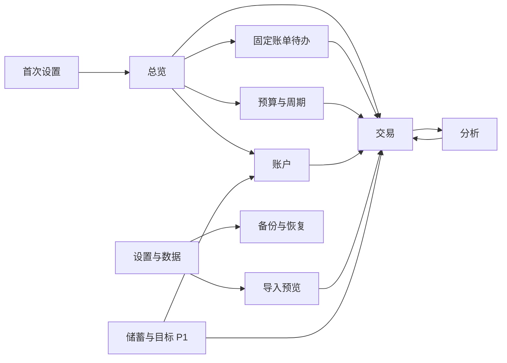

# 薪流 SalaryFlow · 产品与交互设计

## 0.7预算分析、排序与移动端修复（2026-09-12）

预算构成绑定所选预算周期，因为预算是周期快照；实际使用额仍由交易发生日期落入周期后计算。构成图直接标注主要占比，趋势图显示关键金额，悬停或触碰再展示完整详情并轻微突出；颜色随界面配色和明暗主题调整。

交易、预算、支出和收入列表支持与内容匹配的日期、金额、名称和执行率排序。分类分析采用分类组到具体分类的两级结构，保留毛支出、退款和净支出口径。

Android账户总资产遵循全局与局部显示开关AND规则。“每日收支”改名并解释为按实际发生日汇总的收支趋势，可单独查看净支出以避免收入量级压缩。工资分配输入错误不再导致页面退出。

## 0.6.2关于与发布保留策略（2026-09-11）

帮助页增加独立“关于作者”，仅展示用户确认的简洁信息：“XRosen26 使用 Codex 完成了这个产品。”不从其他对话推断或拼接个人资料。

发布目录只保留最新安装版、便携版和校验清单，避免用户误装旧版；产品演进通过CHANGELOG及核心设计文档保留，不依赖堆积旧二进制文件。GitHub仓库保存源码与文档，最新版Release承载Windows成品。

金额输入允许在原框内完成四则运算和括号计算，输入阶段显示结果，提交时转换为整数分；不保存算式中的组成项，因此明确提示“合并后为一笔交易”。说明气泡使用挂载到页面顶层的固定定位，按锚点位置选择上/下方并限制在窗口内，不能再受卡片、面板或滚动容器裁剪。英文界面只本地化可识别的系统预置名称，用户自定义数据不自动翻译。

## 0.6.1操作说明与禁用原因（2026-09-11）

禁用控件不能只显示禁止光标；鼠标悬停或键盘聚焦时必须说明禁用原因以及恢复操作路径。说明气泡使用完整句子，优先回答“为什么不能操作”“去哪里处理”“是否会改变余额或统计”。

预算分类添加区区分两种状态：尚未选择时提示先选择已有支出分类；所有已有分类均已加入时，说明此处不能创建分类，并指向“设置与数据 → 收支分类 → 新增分类”。同类说明覆盖已结算预算、分页边界、账户排序、归档分类和导入错误行。估值、校准、起点、归档与工资分配等高影响动作说明实际结果。

## 0.6周期、分配与理财估值（2026-09-11）

工资分配从交易详情/设置中的隐蔽入口提升为一级页面。本周期已标记工资直接列出；助手展示工资源余额、主要消费余额、总预算、净支出、剩余预算、分配上限、已分配额、实际可分配额、建议补足、储蓄/理财去向及缺口。上限可选本周期工资总额、源账户当前余额或自定义。计划保存不移动资金；用户完成银行转账后可逐项记录或一次记录全部。取消未完成项后可删除计划，已记录转账保留。

预算设置先选按工资周期或自然月，再选立即、下周期或指定日期生效。总览把预算计划与主要消费账户真实余额并列，并给出两者较小的“当前可安心支出”。账户页总资产及每个账户分别保存显示偏好，同时受全局金额开关约束。

新增理财估值账户：首次设置提供可编辑默认账户，账户卡可按日更新总市值；同日更新为修正，估值后真实转账继续叠加。估值涨跌不进入收入、支出、预算或储蓄率。

## 0.5金额隐私、周期与重置（2026-09-11）

顶部金额按钮是总开关；总览预算、收入、总资产卡和每张账户卡另有局部开关。金额仅在总开关与对应局部开关同时允许时显示。总开关关闭只遮罩，不覆盖局部偏好，用户可提前配置各卡片状态。

修改工资日弹层要求选择立即应用或7天后开始新规则，并说明当前过渡周期的结束日变化。设置的数据页提供独立危险区；清空需输入确认词、经过系统弹窗二次确认，可选择删除应用管理的备份，完成后回到首次设置。

## 0.4可视化与配色（2026-09-07）

趋势仅绘制所选范围与截至今天范围的交集，未来日期不画假零值。默认62天内逐日、180天内每7天分组、更长按自然月；可选择粒度，标题明确汇总单位，保留精确数据表。柱状/折线共用金额尺度；单独选择净支出解决大额收入压缩支出的问题。

构成环形图提供支出分类、收入来源、当前账户资产维度。支出按毛额、退款另列；账户图只包含当前正余额，明确不是所选期间的历史资产。前七项加其他合计，保留金额/比例和支出下钻。

配色增加海蓝、鸢紫、暖琥珀、玫瑰、石墨，保留森绿。主题与配色独立，状态色不受配色影响。总览预算卡以已用净支出/总预算计算整卡色相，绿色→红色、超支红色加深，保持文字对比度；总预算为零时无虚假执行率。

## 0.3交互补充（2026-09-07）

总览“本期待办”始终显示新增和查看全部；未来账单规则展示下次到期日，到期实例可确认支付、延期或跳过，处理后留在历史。延期提醒不会提前出现在总览。待办上限不是一条。

记账分类增加其他/自定义及理财收益说明。工资标记旁问号解释分配用途；退款显示剩余可退和25/50/75/100%快捷填入。余额不足保存失败显示具体核对方式，不会悄悄保存。

预算页直接提供工资日与当前周期边界入口，保留安全限制说明。预算剩余金额与条形按使用比例渐变，超支正红并随比例加深，同时保留数字与文字状态。

分析页先展示主要指标和趋势/支出结构，随后收入结构及前期等长区间对比；连续日期补零，正负值使用同一纵轴比例。设置增加可搜索帮助、数据目录迁移和只清理缓存入口。图标提供悬停标题，金额隐藏说明其视觉作用及边界。

版本：V1 已确认设计基线｜2026-09-06｜中文MVP已实现，0.2.0增加中文 / English界面选择。本文含后续交互目标，实际范围及差异见 [IMPLEMENTATION.md](./IMPLEMENTATION.md)。

需求与业务口径及已确认D决策见 [PRD.md](./PRD.md)，技术基线见 [ARCHITECTURE.md](./ARCHITECTURE.md)。语言在设置中切换，账户、分类、备注保留原文；默认中文，浅深主题独立保存。

## 1. 体验原则

打开应用先看到“本周期剩余预算”和“账户资产”，用明确标签区分规划与现实。记账入口始终可见；不通过多页跳转完成普通收支。数据来源、计算口径和截止日可展开查看，默认不让主界面充满解释文字。

所有金额可以下钻到同一筛选口径的交易列表。数据保存失败时保留表单，给出可重试的原因。计算中的汇总标“更新中”，不能把过期数字装作保存后的结果。账户名称、数量、分类名称不决定界面逻辑。

## 2. 完整信息架构

| 一级页面         | 二级页面/局部视图                                              | 核心功能                                         | 主要关联                                     |
| ---------------- | -------------------------------------------------------------- | ------------------------------------------------ | -------------------------------------------- |
| 总览             | 本周期概览、账户概览、到期待办                                 | 收入/预算/净支出/剩余/净结余；账户余额；快速记录 | 卡片→交易/预算；账户→账户详情；待办→账单确认 |
| 交易             | 全部交易、交易详情、修改历史、回收站、分配记录                 | 搜索、筛选、新增/修改/删除/恢复、退款关联        | 返回来源页面保留筛选；分类/账户可钻取        |
| 预算与周期       | 当前周期、周期列表、预算编辑、个人默认、预算历史、周期结算     | 三层模板、预算状态、周期切换、结算修订           | 实际列→交易；结算→分析；工资→分配助手        |
| 账户             | 账户列表、账户详情、账户编辑、余额校准、角色设置               | 动态账户、类型、默认角色、资产与余额             | 明细→交易；校准→调整记录；归档→引用影响      |
| 分析             | 收支趋势、分类分布、净结余趋势、明细表                         | 指定的全部时间范围、对比、导出                   | 图形→交易；工资周期→预算；无隐含预算摊分     |
| 设置与数据       | 分类、工资周期规则、固定账单、导入、导出、备份恢复、外观、关于 | 低频配置、数据可迁移性和修复                     | 导入→暂存预览/结果；备份→恢复向导            |
| 储蓄与目标（P1） | 目标列表、目标详情、资金预留、储蓄账户流向                     | 目标金额/期限/进度、预留与缺口                   | 账户→预留；实际付款→交易；净结余→分析        |

P0 侧栏只有六项；固定账单设在设置中，但到期待办在总览可直接操作。P1 目标功能上线时才出现第七项，不放无法使用的占位页。预算模板库、自动建议属于预算页面 P1 子视图。

全局弹层：新增交易、账户选择、分类选择、日期范围选择、工资分配、保存差异、删除影响、恢复影响。首次设置为独立向导，完成后不占常驻导航。



导航约定：返回保留搜索与滚动位置；从统计钻取传递完整筛选条件；顶部始终显示当前页面自己的时间口径。总览切工资周期不会暗改分析页的自然月筛选。交易详情显示录入时间，但交易列表默认排序按实际日期降序、再按录入时间和ID稳定排序。

## 3. 主要用户流程

### F01 首次启动

欢迎页提供“新建账本”与“从备份恢复”。新建仅要求：工资日 → 账户与基准余额 → 预算预览 → 完成。默认账户以可编辑建议卡片出现，用户明确接受后才创建，不自动写入三张不存在的银行卡。

账户至少一个，可以把多个角色指向同一账户；期初金额允许0，必须看见基准日期提示。预算推荐显示总额¥6,310，可改、全选停用或空白开始。固定账单作为最后一步可跳过。确认前显示摘要，确认时原子写入账本设置、账户、期初记录、个人默认、首周期与预算。

退出向导保留非财务草稿，下次继续；未确认前不产生一半真实账本。中途开始提示“本周期仅从×日开始记录”，不把残缺数据当完整历史。备份恢复入口走 F18。

### F02 创建、修改、删除账户

账户页→新增：名称、类型、角色多选、主要角色开关、期初日期、期初余额、备注。类型与角色分区展示，工资/消费/储蓄不出现在载体类型下。相同类型可有多个账户，名称相近仅提示不强制合并。

编辑名称/图标/顺序后历史交易仍引用同一账户ID；详情可见名称修改历史。角色变化只影响后续默认选择，不迁移交易。改期初余额需要走“修正期初记录”并显示影响，不是普通外观编辑。

删除先查引用：未使用且零余额→软删除；已有历史→“归档账户”及影响说明；要求替换主要角色，处理未支付账单。归档账户仍可在“含归档”筛选中看到，相关历史可下钻。

### F03 设置预算/修改默认

预算页→选择工资周期→编辑分类行。显示初始、本次编辑前、拟修改值和总计。删除/暂停行时解释“历史支出仍计入”。保存弹层两个选项：“仅修改本周期”（预选）、“同时将当前完整预算保存为个人默认”；第二项显示默认模板差异。已结算周期先走重新打开。

个人默认页独立编辑：顶部标明“用于以后新建周期”，已有周期不会变化。用户主动恢复系统建议时展示替换差异。新增周期支持个人默认、复制上期、空白；P1 再加入多模板库。

### F04 工资到账

全局新增→收入→工资，默认工资账户，可改金额/实际日期/备注。确认后只生成一笔收入，随后提示“查看工资分配建议”。晚发工资显示实际日期对应的周期，给出计划周期解释，不自动把日期移到工资日。

一个周期可有多笔工资，也可以没有工资。重复录入相同日期金额仅提示，用户可确认确有两笔；保存按钮幂等避免双击重复。

### F05 工资分配

选择已入账工资→展示本周期预算余额、消费账户余额、源账户可分配额→计算建议→允许调整保留额/转账额→保存计划。明确文字：“请在银行或支付工具完成转账后确认记录。”

每项提供“已完成，记录转账”“关联已有转账”“取消此项”。可部分完成，不要求现实转账同步完成。执行前再次校验余额与计划版本，有变化先刷新建议。工资账户与消费账户相同采用留存资金规则；源/目标相同不显示自转账。无储蓄默认账户时可选其他账户或留在原账户，不阻断工资入账。

### F06 新增其他收入

新增→收入→金额、收入分类、账户、实际日期、备注。账户缺失可内联创建后返回；分类缺失可新增叶子分类。确认后更新 I 与余额，预算额度不随收入自动扩大。奖励、工资、利息为分类/子类型，不创建不同存储表。

### F07 新增支出

新增默认支出，焦点在金额；选择分类/账户/日期，展示该分类“保存后剩余预算”。键盘可完成。余额不足按 D08 推荐显示核对提示但允许真实记录；预算不足提醒超出金额，不禁止用户记真实消费。未设置预算分类仍可记录。

### F08 账户转账

新增→转账→源账户、目标账户、金额、日期，可交换方向。保存前展示两侧余额变化；同账户不可保存。手续费通过附加字段生成独立支出并展示总付款额；手续费与转账一起提交，结果列表主行一笔转账，可展开关联手续费。

### F09 退款

原支出详情→记录退款→默认未退金额，可部分退款，选择到账日期/账户。显示“已退/本次/剩余可退”和本次影响周期，分类沿用原消费。退款列表可跳回原支出。导入未匹配退款进入待处理，不强行分类为收入。

### F10 修改/删除/恢复交易

详情→编辑→显示改前/改后差异及影响：相关账户、旧/新周期、退款、账单、分配项。日期跨结算周期时要求重新打开和原因；不能仅在UI解除锁定。保存后刷新所有依赖汇总。

删除使用影响确认，关联退款可整组撤销；账单退回待确认；分配项退回未完成，需用户核实现实转账。回收站恢复同样预览依赖和冲突。审计视图展示版本、时间、变更字段、原因；不提供绕过校验的直接“恢复旧数据库行”。

### F11 固定账单

设置→固定账单→新增，输入名称、建议金额、分类、账户、频率、到期规则、开始/结束日。首页到期卡→确认实际日期金额→生成支出或关联已有支出。可跳过本次、延期、停用规则。错过多个周期的待办补齐后分组展示，不能直接把全部历史账单自动记入支出。

### F12 新工资周期创建

启动发现进入新周期→显示“新周期待设置”卡→预览起止日和预算来源→修改→确认开放。上一周期未结算不阻止新周期记账。连续未使用数月时补齐周期边界，空周期标无记录，不批量伪造收入或支出。历史补录周期默认空白预算，明确当时计划未知。

### F13 周期结算

周期页→结算→检查未处理账单/未分类/未完成分配/账户核对提醒→查看初始预算与当前预算、实际收支、净结余、校准差异→写复盘备注→确认。提醒可带理由略过；结算只是复盘快照，不搬钱、不计“结余收入”。后续修改走重新打开并保留旧快照。

### F14 储蓄

P0 总览净结余卡→净结余趋势与计算明细；“把钱转入储蓄账户”→普通转账。两条路径文案明确区分资金积累与资金位置。

P1 目标页预留资金时，显示源账户余额、已有预留、剩余可预留；预留操作不产生财务收支。撤回预留也不产生收入。

### F15 财务目标（P1）

目标列表→创建名称/目标额/截止日→选择当前账户资金做预留→看进度和预计每期需要预留额（仅建议）→追加/释放预留。购买目标物品时记录真实支出并释放预留，目标页分别显示累计用于目标的消费和仍持有的预留。完成或取消前确认剩余预留去向；不自动向银行转账。

### F16 数据分析

分析页→选择时间口径与区间→选择指标/分类→看摘要、图表、表格→点击柱或分类钻取交易。范围选择器包含工资周期、自然周/月/季/年、最近7/30/90天、最近3/6/12个月、自定义，并始终展开显示具体日期。

自然月视图不显示工资周期预算执行率；用户转到工资周期视图才显示预算对比。账户筛选启用时显示资金流入/流出及转账列，不展示含义不清的个人储蓄率。对比仅选两个明确区间，无数据不自动补成有意义的增长率；基期为0显示绝对差值。

### F17 数据导入/导出

导入五步：选文件与来源→映射字段/账户/分类→预览识别→解决错误和重复→确认结果。显示原始行号、标准化值、错误说明、计入统计的交易数和被排除数。疑似重复可并排查看现有记录。导入提交时禁止关闭误触，提供明确进度；取消在提交前安全终止，事务失败全部回滚。

导出：交易或分析页→选择当前筛选/全部数据→选择格式→预览内容和保存路径→保存成功后打开所在目录。完整JSON与CSV报表分组显示，注明报表不含完整审计；P1 XLSX/Markdown不是假按钮，届时再出现。

### F18 数据备份与恢复

备份页展示最近成功时间、文件位置、校验状态、失败原因与重试。手动备份可选路径；自动任务只在运行期间进行，应用关闭时不宣称仍在备份。

恢复：选择文件→读取账本/生成时间/记录数/版本→校验→显示“将替换本机当前账本，不合并”→用户确认→先备份当前数据→关闭写入→在临时目录升级验证→替换→重新载入并显示对账摘要。失败保持当前账本可用。选择未来版本备份时解释需用支持该版本的应用，不尝试破坏性降级。

## 4. 低保真页面结构

以下数字属于统一演示账本，不代表用户真实数据。示例期初：工资卡0、消费卡700、储蓄卡3000；工资收入10000，消费补足4500、转储蓄5500、消费支出1200。当前三账户为0/4000/8500，总资产12500；本期净结余8800、预算5200、剩余4000。收入和期初分开，示例可用于后续验收。

### W01 总览

```text
┌ 薪流  预算·现金流·储蓄                 [金额显示] [＋记一笔] ┐
│ 总览       本周期 2026/09/10—10/09 [切换]  截至 09/20      │
│ 交易       [收入 10,000] [预算 5,200] [净支出 1,200]       │
│ 预算与周期 [剩余预算 4,000] [净结余 8,800] [储蓄率 88%]    │
│ 账户       分类预算                       本周期待办       │
│ 分析       餐饮  980/1,500 正常 [查看]     房租 待确认     │
│ 设置与数据 交通  220/200   超出20 [查看]   [查看全部]       │
│            账户资产 12,500 [全部/常用]                    │
│            工资卡 0 | 消费卡 4,000 | 储蓄卡 8,500         │
│            最近交易 [查看全部]                           │
└──────────────────────────────────────────────────────────┘
```

六个指标可在窄窗口排两行；预算组与资产组用不同标题与间距。演示只显示部分分类行，不能把这两行当作5200全预算。净结余卡点击可查看“收入−支出+退款”的明细。

### W02 交易列表与详情

```text
交易  [日期范围] [账户] [分类] [类型] [搜索备注] [＋记一笔]
日期        类型      分类/方向             金额       账户
09/20       支出      餐饮/外食             -35.00     消费卡
09/10       转账      工资卡 → 储蓄卡       5,500.00   [双向]
09/10       收入      工资                 +10,000.00 工资卡
                                               ┌详情抽屉─┐
                                               │实际日期 │
                                               │预算周期 │
                                               │备注/关联│
                                               │退款/编辑│
                                               │历史/删除│
                                               └─────────┘
```

转账主列表只一行，账户明细可按所属账户显示方向；统计明确不把两侧当两笔收入。筛选后空状态提供“清除筛选”，新用户无交易则提供“记第一笔”。

### W03 新增交易抽屉

```text
[支出] [收入] [转账]                         [关闭]
金额       ¥ [             ]
分类         [餐饮/外食 v]
付款账户     [消费卡 v]      当前余额 ¥4,000.00
实际日期     [2026/09/20]    归属周期 09/10—10/09
备注         [             ]
保存后本分类剩余预算 ¥...
                             [取消] [保存] [保存并继续]
```

退款从原交易进入以减少误关联；完整退款也可通过交易类型入口先选择原支出。保存使用字段级错误，不清空已填内容。关闭未保存表单时提供保留草稿/丢弃/继续编辑。

### W04 预算与周期

```text
预算与周期 [2026/09/10—10/09 v] [开放] [个人默认] [结算]
来源：个人默认 v3  初始预算5,000  当前预算5,200 [历史]
分类             初始     当前     实际      剩余     状态
餐饮            1,500    1,500      980       520      正常
交通              200      200      220       -20      超出20
未设预算            —        0        0         0      —
[＋预算项目]                                     [编辑预算]
保存修改： (●)仅本周期  ( )同时保存当前完整预算为个人默认
变更说明 [                                      ] [保存]
```

原始额度与调整后的额度不叠加；表头明确实际是净支出。停用项有历史实际时仍显示。结算面板展示初始/调整后的超支差别，避免调大预算掩盖原计划偏离。

### W05 账户与校准

```text
账户 [常用/全部/含归档]                     [新增账户]
全账本资产 ¥12,500.00
名称       类型      用途角色            余额       操作
工资卡     银行卡    主要工资              0.00     详情
消费卡     银行卡    主要消费          4,000.00     详情
储蓄卡     银行卡    主要储蓄          8,500.00     详情

账户详情：余额 | 期初基准日 | 收支与转入转出 | 历史交易
校准弹层：账面余额 [只读] 银行实际余额 [输入] 差额 [计算]
          原因 [必填] 生效日期 [日期] [预览并记录校准]
```

### W06 工资分配助手

```text
分配工资 ¥10,000.00       来源：工资卡/09月10日收入
本周期预算 5,200    已花0     剩余目标5,200
消费账户 [消费卡 v] 可用700  建议补足4,500
储蓄账户 [储蓄卡 v]          建议转入5,500
源账户保留 [0]  本次最多分配 [10,000]  [重新计算]
□ 我已实际完成消费账户转账  [记录/关联已有转账]
□ 我已实际完成储蓄账户转账  [记录/关联已有转账]
                                        [保存未完成计划]
```

计划显示生成时间；任何影响金额的交易变化后标“需要重新计算”，不能沿用过期建议直接入账。

### W07 分析

```text
分析 [自然月 v] [2026年9月]  09/01—09/30 截至09/20 [导出]
[收入] [毛支出] [退款] [净支出] [净结余] [储蓄率]
每日收支趋势（柱状/折线）           分类金额（水平条形）
可切换为表格，悬停显示精确金额，点击钻取交易
明细汇总表：分类 | 支出 | 退款 | 净支出 | 占比
```

负净支出不强行画饼图。分类占比默认用非负毛支出为分母，图标题写“毛支出占比”；净额另列。没有毛支出则无占比，不画100%的空饼图。

### W08 数据中心与目标

```text
设置与数据 > 数据
[导入CSV] [导出CSV/完整JSON] [立即备份] [恢复备份]
最近备份 09/20 20:00  已校验   位置 ... [打开目录]
导入批次：时间 | 来源 | 新增 | 跳过 | 待处理 | 查看详情
备份列表：时间 | 账本版本 | 大小 | 校验 | 恢复

储蓄与目标（P1）
应急金  8,000/20,000 已预留    截止日... [查看资金来源]
旅行    1,000/5,000  已预留    可继续预留... [调整]
可用资金不足时明确显示缺口，不继续宣称已经足额预留
```

## 5. 桌面 UI 规范

| 项目       | 规范建议                                                                                                          |
| ---------- | ----------------------------------------------------------------------------------------------------------------- |
| 窗口       | 设计基准1440×900；建议最小可用1024×720；适配125%/150%/200%缩放，不靠固定像素塞表格                                |
| 框架       | 左导航约208逻辑像素，顶栏56，内容边距24；密集数据表可16；页面不横向整体溢出                                       |
| 排版       | 中文 Microsoft YaHei UI，英文 Segoe UI，系统回退；正文14—16，辅助12—13，标题20—24，核心金额28—32                  |
| 数字       | 等宽数字、右对齐，千分位和两位小数；收入带+、支出带−；转账显示方向且不用支出色误导                                |
| 浅色       | 背景#F6F7F9，面板#FFFFFF，正文#182230，次要#526071，边框#D8DEE7，主操作#2457C5                                    |
| 深色       | 背景#11151C，面板#1B222C，正文#EDF1F7，次要#ADB8C7，边框#384353，主操作#8BAEFF                                    |
| 状态       | 成功/接近/超支分别配文字与图标；浅色候选#18734D/#8A5700/#B42318，深色使用提亮版本；正式实现测对比度               |
| 可读性     | 普通文本对比度目标≥4.5:1，重要控件边界/焦点≥3:1；不使用透明文字叠彩图背景                                         |
| 间距与形状 | 4/8/12/16/24/32尺度；卡片圆角8，控件6；少用阴影；不用大面积渐变或装饰性动画                                       |
| 控件       | 常规高度36—40；表格行40左右，可选紧凑；主要动作每区域最多一个；危险操作放次级菜单                                 |
| 图表       | 优先条形、折线；同指标颜色稳定；图例、精确金额和表格替代；避免3D、双轴误读和只有颜色的图例                        |
| 主题       | 跟随系统/浅色/深色，保存用户选择；切换后图表和原生弹层也验证；金额显示为全局与卡片/账户双层偏好，任一层关闭即遮罩 |
| 动效       | 仅短暂反馈，尊重减少动态效果；不在金额刷新时滚动跳数影响核对                                                      |

这些颜色是待视觉测试的设计值，不宣称已完成无障碍认证。正常文字的可读性优先于轻盈感。

键盘：Ctrl+N新增、Ctrl+F搜索、Tab顺序移动、Enter确认当前表单、Esc关闭弹层；删除不绑定单键全局快捷键。控件焦点始终可见；组合输入法编辑期间Enter不能误保存。弹层焦点锁定，关闭后回到原控件。金额输入支持粘贴并规范显示，非法内容显示原值和错误，不自动修改金额。

表格：标题固定、金额对齐、账户/分类长名省略但可查看全文；行选中和键盘选中一致。多行操作先展示影响数量；没有批量操作需求时不引入复杂选择系统。保存成功显示轻提示，涉及删除/恢复/跨期修改必须有明确结果摘要。

## 6. 异常与信息完整性

| 场景            | 页面反馈                                            |
| --------------- | --------------------------------------------------- |
| 数据未配置      | 提供完成配置入口；不把缺失数据显示成真实0元         |
| 真正无交易      | “此范围没有交易”，可新增或修改筛选                  |
| 有交易但净额为0 | 显示0，同时保留交易数量、毛支出和退款               |
| 数据库忙/磁盘满 | 保留表单，说明尚未保存，重试时沿用幂等ID            |
| 备份失败        | 常驻可见的数据提醒；成功后消除；不每次重复弹窗      |
| 历史修订        | 先展示受影响范围，保存后更新相关页面与旧结算标签    |
| 数据损坏        | 停止写入、提供恢复/诊断副本；不自动创建空库覆盖     |
| 升级中          | 进度与当前阶段；未成功不得打开可编辑账本            |
| 工资分配不足    | 明确短缺额，可调整目标或部分分配，无虚构资金        |
| 数据不完整      | 首期/历史导入期间标记记录起点，不输出误导的改善结论 |

## 7. 可用性验证计划

设计确认后用低保真原型走查：首次设置、15秒支出、改本期不改默认、工资分配、跨期退款、删除有退款支出、恢复备份。让用户解释“余额”“剩余预算”“净结余”三个数字，解释不清则调整标签与层级。

正式开发中验证100笔与100,000笔数据、20账户/100分类、长中文名、浅深主题、键盘、Windows缩放。这里仅定义走查任务与验收目标，未声称已有原型或测试结果。
